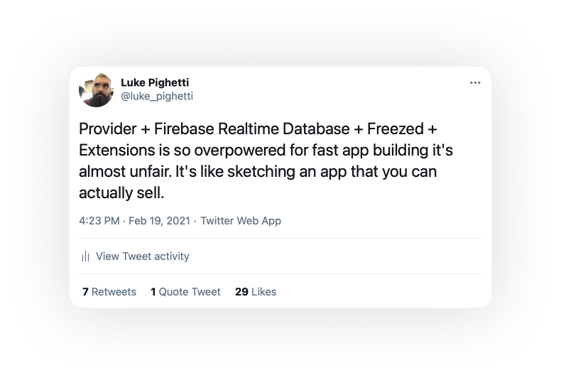

# fb_arch

I made [this tweet](https://twitter.com/luke_pighetti/status/1362875378247819264) and people wanted an article so instead I made a sketch that is about 80% implemented.

## QCFlutter Talk

https://www.youtube.com/watch?v=kAWqZNvLrGg&t=315s

## TLDR

Extend firebase services with backend-like methods that don't act on any service but itself.

Extend FirebaseApp with flows that don't require authentication.

Extend User with flows that require authentication.

Find an easy way to access User and all your services. I like `Provider<User>` and `mixin FirebaseServices`.

Data goes up, Firebase RTDB acts as a repository, data is dispatched to your streams and to firebase. The architecture is extremely simple and very fast to write and quite powerful.
